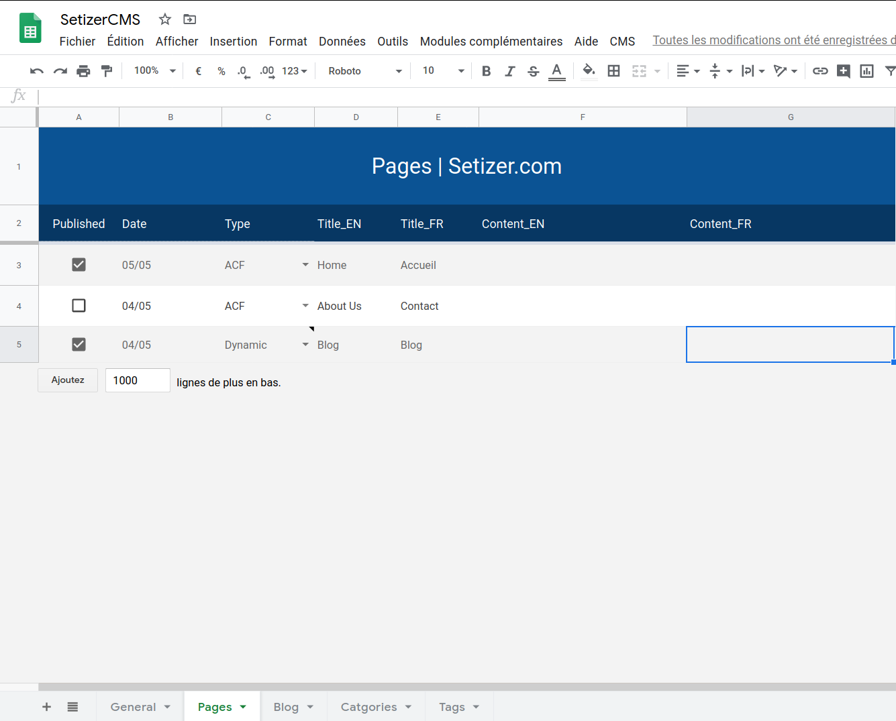

# SetizerCMS
Google Sheets could be your new CMS for Gatsby or others projects.

## Why use Google Sheet to manage your content :

🧑‍🤝‍🧑 Easy collaboration  
📱 Desktop web, Mobile app  
🛩 Offline redaction  
💸 External CMS not needed
🔥 No content in your source code  

## What does SetizerCMS offer you : 

🈂️ Easy i18n (Internationalization)  
🔨 Pages ACF (key, value) : ideal for a full custom template  
🧲 Pages Dynamic (Relationnal Sheets) : ideal to create a blog, ...  
🗂️ MultiSelect Dropdown (DataValidation)  
📩 Extract system to JSON  
🛡️ Secured request to get JSON from your Google App  
✨ Trigger build  
✍️ WYSIWYG integrated (**coming soon**)  

## Start Now !
Create your copy of [SetizerCMS](https://docs.google.com/spreadsheets/d/1mmuNDD11eCYA3YtqJAH7vBXUl5a7jj17fVZuHB1VkY4/copy).

## Todo List
- [ ] Little documentation
- [ ] WYSIWYG integrated
- [ ] Gatsby Plugin Source 
- [ ] Starter Gatsby
